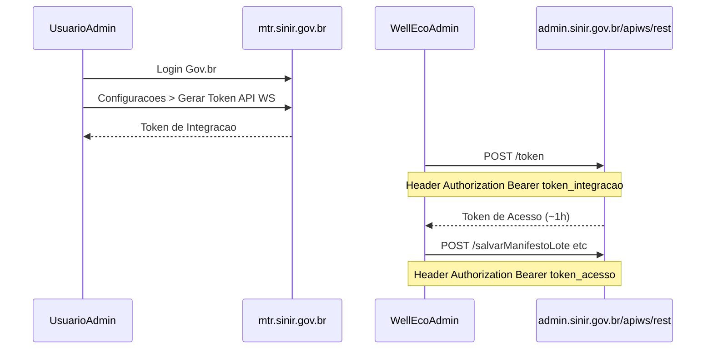

# Integração SINIR — MTR Nacional

> Atualizado em 2026-09-11 após teste real de autenticação.

## URLs oficiais

| Recurso | URL |
|---------|-----|
| Portal MTR (produção) | https://mtr.sinir.gov.br |
| API REST (produção) | `https://admin.sinir.gov.br/apiws/rest` |
| Portal documentação | https://portal-api.sinir.gov.br |
| Suporte MTR | mtr@sinir.gov.br |

**Homologação:** `homolog-admin.sinir.gov.br` e `homolog-mtr.sinir.gov.br` **não resolvem DNS** (indisponíveis em set/2026). Desenvolvimento deve usar produção com cuidado ou solicitar ambiente de teste ao MMA.

---

## Autenticação API — mudança crítica (01/08/2026)

O endpoint legado **`POST /gettoken`** com `cpfCnpj` + `senha` + `unidade` foi **desativado**.

Resposta atual (404):
```json
{
  "mensagem": "Endpoint desativado em 01/08/2026. A autenticação por usuário e senha foi removida desta API. Gere o Token de Integração no Sistema MTR (Configurações > Gerar Token API WS) e troque-o por um Token de Acesso em POST /apiws/rest/token.",
  "erro": true
}
```

### Novo fluxo (Web Service)



1. Acessar **https://mtr.sinir.gov.br** com **Gov.br** (obrigatório desde 01/08/2026 para interface web).
2. Menu **Configurações → Gerar Token API WS** (usuário administrador).
3. Copiar o **Token de Integração** gerado.
4. Trocar por token de acesso:
   ```http
   POST https://admin.sinir.gov.br/apiws/rest/token
   Authorization: Bearer {TOKEN_DE_INTEGRACAO}
   Content-Type: application/json
   ```
5. Usar o token de acesso retornado nas demais rotas (`salvarManifestoLote`, etc.).

Resposta atual de `POST /token` (set/2026):

```json
{
  "mensagem": "Autenticado com sucesso",
  "objetoResposta": "Bearer {token_acesso}",
  "erro": false
}
```

O `SinirAuthService` extrai o token de `objetoResposta` (com ou sem prefixo `Bearer`).

Erro se faltar token de integração:
```json
{"mensagem":"Token de integração não informado no header Authorization (Bearer).","erro":true}
```

---

## Credenciais Well Eco (cadastro existente)

| Campo | Valor |
|-------|-------|
| CNPJ | 18.675.233/0001-50 |
| Código unidade | 135551 |
| Empresa | WIDMER TRINDADE DE BEM - ME |
| CPF usuário | 027.506.321-61 |

**Login/senha do portal:** válidos apenas para acesso **web** (via Gov.br). **Não servem mais** para `/gettoken` na API.

**Nunca commitar** senha ou token de integração no Git. Usar `.env`:

```env
SINIR_ENV=production
SINIR_UNIDADE=135551
SINIR_CNPJ=18675233000150
SINIR_INTEGRATION_TOKEN=   # gerado em Configurações > Gerar Token API WS
SINIR_ENABLED=true
SINIR_UNIDADE_DESTINADOR=
```

`SINIR_UNIDADE_DESTINADOR` é opcional (default = `SINIR_UNIDADE`).

---

## Endpoints principais (pós-autenticação)

Base: `https://admin.sinir.gov.br/apiws/rest`

| Ação | Método | Rota |
|------|--------|------|
| Obter token acesso | POST | `/token` |
| Listar resíduos | GET | `/retornaListaResiduo` |
| Listar classes | GET | `/retornaListaClasse` |
| Listar unidades | GET | `/retornaListaUnidade` |
| Listar tratamentos | GET | `/retornaListaTratamento` |
| Listar estados físicos | GET | `/retornaListaEstadoFisico` |
| Listar acondicionamentos | GET | `/retornaListaAcondicionamento` |
| Emitir MTR | POST | `/salvarManifestoLote` |
| PDF MTR | POST | `/buscaPdfManifestoPorCodigoBarras/{cod}` — cache em `storage/coletas/{id}/` (`ColetaCdfService`, portal gerador) |
| Cancelar | POST | `/cancelarManifesto` |
| Receber (destinador) | POST | `/receberManifestoLote` — painel Coletas → **Receber no SINIR** (`SinirRecebimentoService`) |
| Emitir CDF | POST | `/emiteCDF` — **Emitir CDF SINIR** (`SinirCdfService`) após recebimento |
| PDF CDF | POST | `/buscaPdfCdf/{codigo}` — cache em `storage/coletas/{id}/` |

Header em todas (exceto troca inicial): `Authorization: Bearer {token_acesso}`

---

## Manual correto vs MTR-LR

| Documento | Uso |
|-----------|-----|
| **MTR Regular — Manual v1.10** | Coleta Well (gerador/transportador/destinador) |
| **Manual Integração Web Service MMA** | Desenvolvimento API (verificar versão pós-ago/2026) |
| MTR-LR Manual do Usuário | Logística Reversa / Recicla+ — **não** é o fluxo Well |

PDF Regular: https://portal-api.sinir.gov.br/wp-content/uploads/2026/07/MANIFESTO-DE-TRANSPORTE-DE-RESIDUOS-%E2%80%93-MTR-1.10.pdf

---

## Implementação Well Eco (Fase B)

| Peça | Arquivo |
|------|---------|
| Auth token | `app/Service/Sinir/SinirAuthService.php` |
| HTTP API | `app/Service/Sinir/SinirGateway.php` |
| Payload MTR | `app/Service/Sinir/SinirPayloadBuilder.php` |
| Envio + auditoria | `app/Service/Sinir/SinirManifestoService.php` |
| Hook finalizar | `ColetaService::finalizar()` → `salvarManifestoLote` |
| Reenvio manual | Coletas → detalhe → **Registrar / reenviar SINIR** |
| Cancelamento | Coletas → detalhe → **Cancelar no SINIR** (`POST /cancelarManifesto`) |
| Consulta situação | Coletas → detalhe → **Consultar SINIR** (`POST /retornaManifesto/…` ou `retornaManifestoPorNumero/…`) |

### Pré-requisitos antes do envio

1. `.env`: `SINIR_ENABLED=true`, token, unidade e CNPJ configurados
2. **Cliente (gerador):** campo **Cód. unidade SINIR** (`clientes.sinir_cod_unidade`) — código da unidade no portal MTR
3. **Tipo de resíduo:** códigos IBAMA + mapeamento SINIR (`codigoTecnologia`, `codigoTipoEstado`, `codigoAcondicionamento`, `codigoClasse`, `codigoUnidade`)
4. Migration `010_clientes_sinir_unidade.sql` aplicada

### Smoke test (CLI)

```bash
php database/scripts/sinir_diagnose_rede.php   # 1º — testa se o servidor alcança a API
php database/scripts/sinir_smoke_token.php       # 2º — testa token de integração
php database/scripts/sinir_sync_residuos.php --dry-run --csv=storage/sinir_sync.csv
php database/scripts/sinir_sync_residuos.php     # aplica códigos sugeridos
```

### Sync códigos em tipos_residuos

Script `sinir_sync_residuos.php` consulta as listas oficiais e preenche `cod_ibama` + `tra/tie/tia/cla/uni_codigo` em `tipos_residuos`.

| Flag | Efeito |
|------|--------|
| `--dry-run` | Simula sem gravar no banco |
| `--force` | Sobrescreve tipos que já têm códigos |
| `--all` | Inclui tipos já completos (default: só vazios) |
| `--csv=caminho` | Exporta sugestões para revisão |
| `--dump-lists=caminho` | Salva JSON bruto das listas SINIR |

**Defaults operacionais Well** (quando a API não amarra resíduo → tecnologia/estado/etc.):

- Unidade: Quilograma (kg)
- Estado: Sólido (líquido se nome contém óleo/água)
- Acondicionamento: inferido do nome (big bag, tambor, granel…)
- Classe: Classe II A para recicláveis; Classe I para perigosos / `(*)`
- Tecnologia: Reciclagem (RSS/saúde → incineração quando existir na lista)

Revisar o CSV antes de aplicar em produção. Em XAMPP local, se curl falhar com certificado SSL: `SINIR_SSL_VERIFY=false` no `.env`.

### Timeout / `http_status: 0`

Se o smoke test retorna `Operation timed out` com `http_status: 0`, **não é erro do token** — o PHP no servidor **não consegue conectar** a `admin.sinir.gov.br`.

No SSH da HostGator:

```bash
curl -v --connect-timeout 15 -X POST https://admin.sinir.gov.br/apiws/rest/token \
  -H "Content-Type: application/json" \
  -H "Authorization: Bearer SEU_TOKEN"
```

| Resultado curl | Ação |
|----------------|------|
| Timeout / Connection refused | Abrir ticket **HostGator**: liberar outbound HTTPS para `admin.sinir.gov.br:443` |
| Conecta mas 401/403 | Token inválido ou expirado — gerar novo no portal MTR |
| Conecta e retorna JSON | Rede OK — rodar `sinir_smoke_token.php` de novo |

Em hospedagem compartilhada, o SINIR pode bloquear IPs de datacenter. Se a HostGator liberar e ainda falhar, contatar **mtr@sinir.gov.br** informando o IP público do servidor (cPanel → Informações gerais).

### Fluxo ao finalizar coleta

1. Coleta recebe MTR local e status `finalizada`
2. Se `SINIR_ENABLED=true`, status SINIR → `pendente` e dispara envio
3. Sucesso → `sinir_status=enviado`, `sinir_man_numero`, `sinir_codigo_barras`
4. Falha → `sinir_status=erro`, histórico em `sinir_envios` (reenvio pelo painel)

> Falha no SINIR **não cancela** a finalização local da coleta.
