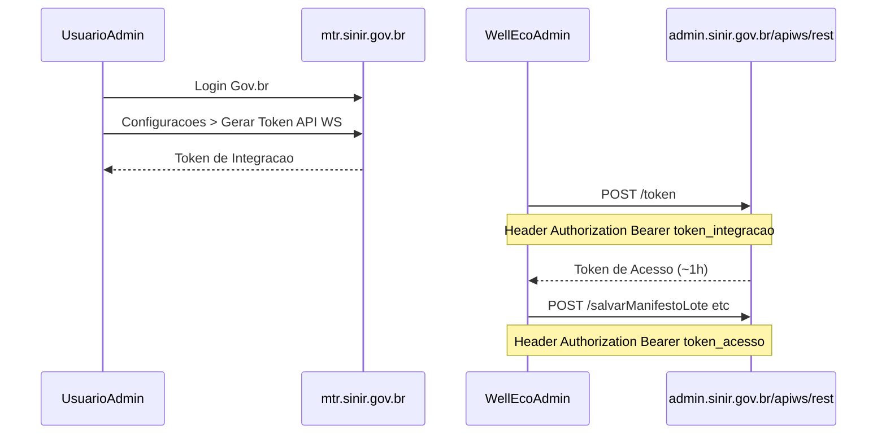

# Integração SINIR — MTR Nacional

> Atualizado em 2026-09-11 após teste real de autenticação.

## URLs oficiais

| Recurso | URL |
|---------|-----|
| Portal MTR (produção) | https://mtr.sinir.gov.br |
| API REST (produção) | `https://admin.sinir.gov.br/apiws/rest` |
| Portal documentação | https://portal-api.sinir.gov.br |
| Suporte MTR | mtr@sinir.gov.br |

**Homologação:** `homolog-admin.sinir.gov.br` e `homolog-mtr.sinir.gov.br` **não resolvem DNS** (indisponíveis em set/2026). Desenvolvimento deve usar produção com cuidado ou solicitar ambiente de teste ao MMA.

---

## Autenticação API — mudança crítica (01/08/2026)

O endpoint legado **`POST /gettoken`** com `cpfCnpj` + `senha` + `unidade` foi **desativado**.

Resposta atual (404):
```json
{
  "mensagem": "Endpoint desativado em 01/08/2026. A autenticação por usuário e senha foi removida desta API. Gere o Token de Integração no Sistema MTR (Configurações > Gerar Token API WS) e troque-o por um Token de Acesso em POST /apiws/rest/token.",
  "erro": true
}
```

### Novo fluxo (Web Service)



1. Acessar **https://mtr.sinir.gov.br** com **Gov.br** (obrigatório desde 01/08/2026 para interface web).
2. Menu **Configurações → Gerar Token API WS** (usuário administrador).
3. Copiar o **Token de Integração** gerado.
4. Trocar por token de acesso:
   ```http
   POST https://admin.sinir.gov.br/apiws/rest/token
   Authorization: Bearer {TOKEN_DE_INTEGRACAO}
   Content-Type: application/json
   ```
5. Usar o token de acesso retornado nas demais rotas (`salvarManifestoLote`, etc.).

Erro se faltar token de integração:
```json
{"mensagem":"Token de integração não informado no header Authorization (Bearer).","erro":true}
```

---

## Credenciais Well Eco (cadastro existente)

| Campo | Valor |
|-------|-------|
| CNPJ | 18.675.233/0001-50 |
| Código unidade | 135551 |
| Empresa | WIDMER TRINDADE DE BEM - ME |
| CPF usuário | 027.506.321-61 |

**Login/senha do portal:** válidos apenas para acesso **web** (via Gov.br). **Não servem mais** para `/gettoken` na API.

**Nunca commitar** senha ou token de integração no Git. Usar `.env`:

```env
SINIR_ENV=production
SINIR_UNIDADE=135551
SINIR_CNPJ=18675233000150
SINIR_INTEGRATION_TOKEN=   # gerado em Configurações > Gerar Token API WS
SINIR_ENABLED=false
```

---

## Endpoints principais (pós-autenticação)

Base: `https://admin.sinir.gov.br/apiws/rest`

| Ação | Método | Rota |
|------|--------|------|
| Obter token acesso | POST | `/token` |
| Listar resíduos | POST | `/retornaListaResiduo` |
| Listar tratamentos | GET | `/retornaListaTratamento` |
| Emitir MTR | POST | `/salvarManifestoLote` |
| PDF MTR | POST | `/buscaPdfManifestoPorCodigoBarras/{cod}` |
| Cancelar | POST | `/cancelarManifesto` |
| Receber (destinador) | POST | `/receberManifestoLote` |

Header em todas (exceto troca inicial): `Authorization: Bearer {token_acesso}`

---

## Manual correto vs MTR-LR

| Documento | Uso |
|-----------|-----|
| **MTR Regular — Manual v1.10** | Coleta Well (gerador/transportador/destinador) |
| **Manual Integração Web Service MMA** | Desenvolvimento API (verificar versão pós-ago/2026) |
| MTR-LR Manual do Usuário | Logística Reversa / Recicla+ — **não** é o fluxo Well |

PDF Regular: https://portal-api.sinir.gov.br/wp-content/uploads/2026/07/MANIFESTO-DE-TRANSPORTE-DE-RESIDUOS-%E2%80%93-MTR-1.10.pdf

---

## Próximos passos Well Eco

1. [ ] Gerar **Token API WS** no portal MTR (admin logado via Gov.br)
2. [ ] Validar `POST /token` com token de integração
3. [ ] Implementar `SinirAuthService` + `SinirGateway` no projeto
4. [ ] Mapear `tipos_residuos.cod_ibama` → códigos SINIR (`traCodigo`, `tieCodigo`, etc.)
5. [ ] Hook em `ColetaService::finalizar()` para `salvarManifestoLote`
